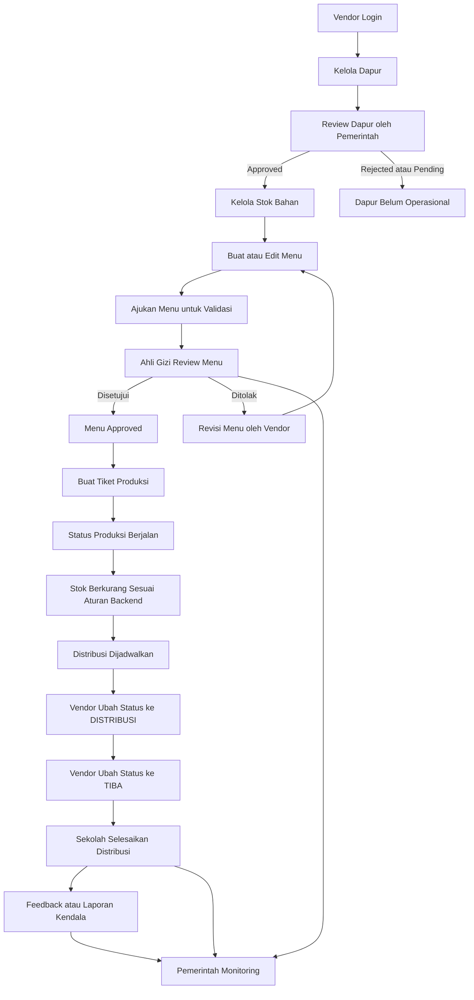
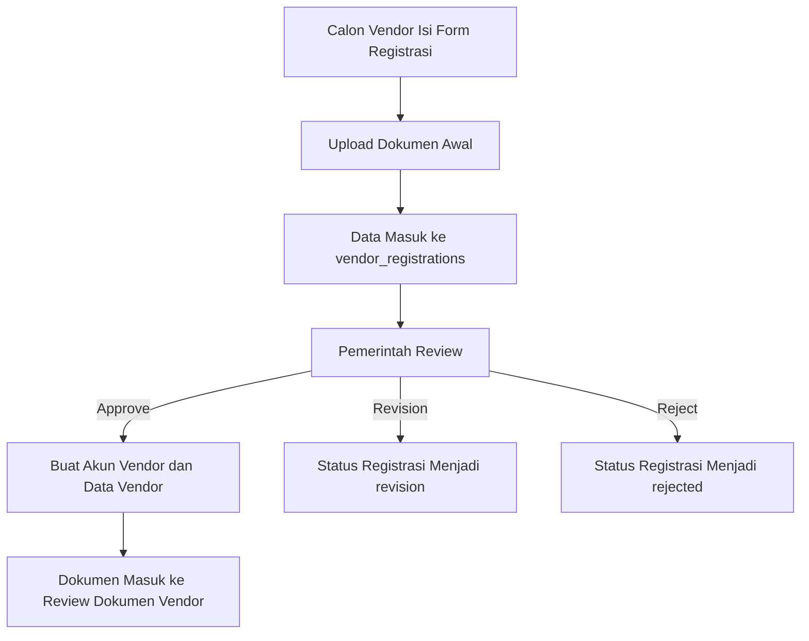
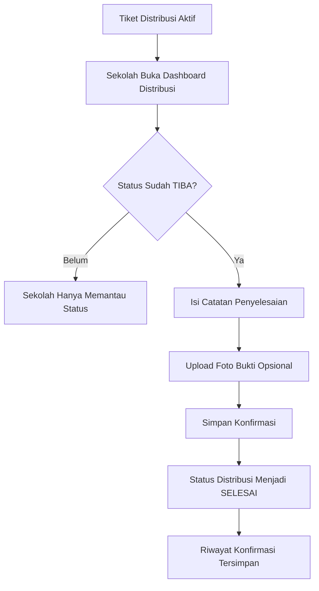

# Flowmap Sistem

## Flowmap Proses Bisnis Utama

## Flowmap Registrasi Vendor

## Flowmap Penyelesaian Distribusi Sekolah

## Catatan untuk Flowmap Final

- Flowmap utama yang paling aman untuk presentasi adalah:
  `Vendor -> Ahli Gizi -> Produksi -> Distribusi -> Sekolah -> Pemerintah`
- Jika dosen meminta flowmap per aktor, pisahkan menjadi:
  vendor flow, ahli gizi flow, sekolah flow, dan pemerintah flow.
- Status `revision` pada registrasi vendor memang ada di backend, tetapi tindak lanjut revisi tidak dibangun sebagai portal self-service terpisah pada implementasi saat ini.
