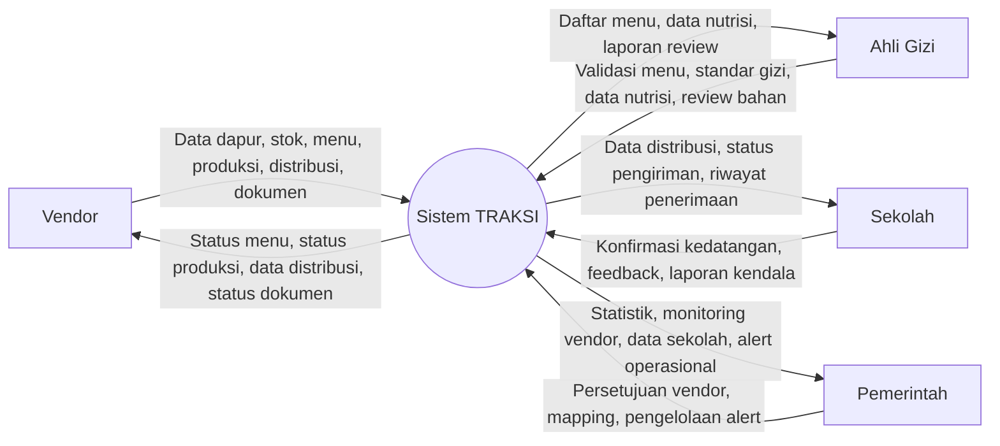

# Context Diagram

## Konsep

Context diagram menempatkan TRAKSI sebagai satu proses besar, lalu menunjukkan hubungan data dengan entitas luar.

## Entitas Eksternal

- Vendor
- Ahli Gizi
- Sekolah
- Pemerintah

## Draft Context Diagram

## Narasi Context Diagram

- Vendor mengirimkan data operasional ke sistem dan menerima status operasional.
- Ahli gizi berinteraksi dengan sistem untuk validasi menu dan pengelolaan standar gizi.
- Sekolah menerima data distribusi dari sistem dan mengirimkan bukti penerimaan serta feedback.
- Pemerintah menggunakan sistem untuk monitoring, validasi administratif, dan pengawasan distribusi.
