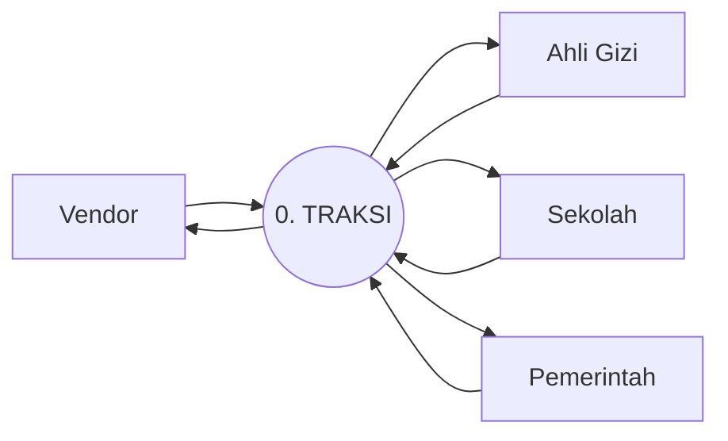
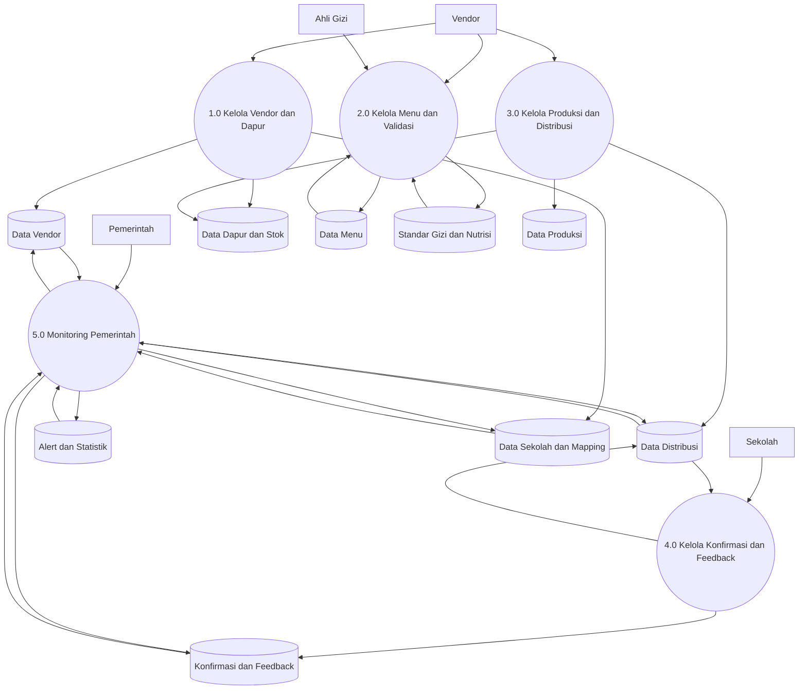

# Data Flow Diagram

## DFD Level 0

## DFD Level 1

## Penjelasan Proses

### 1.0 Kelola Vendor dan Dapur

- Mengelola data vendor
- Mengelola registrasi vendor
- Mengelola dapur
- Mengelola stok
- Mengelola dokumen vendor

### 2.0 Kelola Menu dan Validasi

- Vendor membuat menu
- Ahli gizi memvalidasi menu
- Ahli gizi mengelola standar gizi
- Ahli gizi mengelola database nutrisi

### 3.0 Kelola Produksi dan Distribusi

- Vendor membuat batch produksi
- Sistem memperbarui status produksi
- Sistem mengelola distribusi ke sekolah

### 4.0 Kelola Konfirmasi dan Feedback

- Sekolah mengonfirmasi makanan yang tiba
- Sekolah mengirim feedback
- Sekolah mengirim alert kendala

### 5.0 Monitoring Pemerintah

- Pemerintah memantau vendor, sekolah, mapping, statistik, dan alert

## Saran DFD untuk Laporan

- Untuk laporan akademik, ubah nama data store menjadi kode formal seperti:
  `D1 Users`, `D2 Vendors`, `D3 Menus`, dan seterusnya.
- Jika diminta lebih detail, buat DFD Level 2 untuk:
  proses validasi menu, proses produksi, dan proses konfirmasi sekolah.
