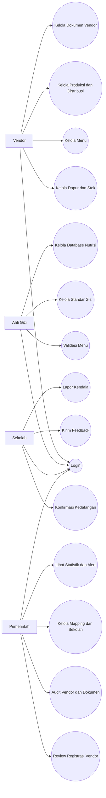

# UML Use Case

## Aktor

- Vendor
- Ahli Gizi
- Sekolah
- Pemerintah

## Daftar Use Case per Aktor

### Vendor

- Login
- Kelola dapur
- Kelola stok bahan
- Lihat histori stok
- Kelola menu
- Upload foto menu
- Kelola dokumen vendor
- Upload dokumen vendor
- Buat produksi
- Ubah status produksi
- Kelola distribusi
- Lihat status validasi menu

### Ahli Gizi

- Login
- Lihat daftar menu
- Validasi menu
- Tulis catatan validasi
- Kelola standar gizi
- Kelola database nutrisi
- Tinjau permintaan bahan
- Generate laporan review

### Sekolah

- Login
- Lihat distribusi
- Konfirmasi kedatangan
- Upload bukti foto
- Kirim feedback
- Laporkan kendala
- Lihat riwayat konfirmasi

### Pemerintah

- Login
- Review registrasi vendor
- Approve/revisi/tolak vendor
- Audit vendor
- Audit dokumen vendor
- Suspend atau aktifkan vendor
- Kelola mapping dapur-sekolah
- Kelola sekolah
- Lihat statistik
- Kelola alert

## Draft Use Case Diagram

## Saran UML Lanjutan

- Jika Anda juga perlu class diagram, lanjutkan dari file `08-entity-reference.md`.
- Jika dosen meminta activity diagram, use case berikut paling cocok:
  validasi menu, proses distribusi, dan konfirmasi kedatangan.
